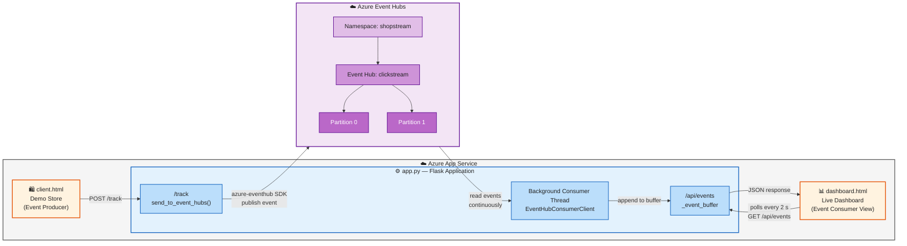
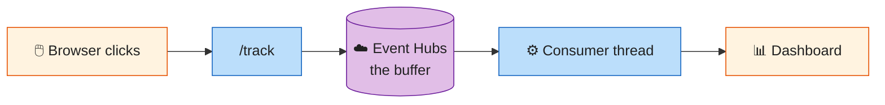
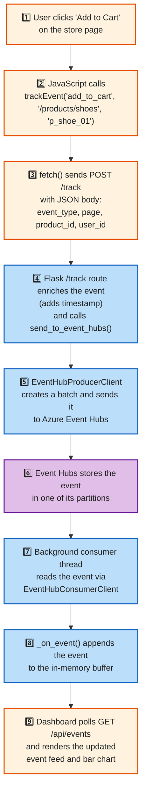

# Week 10 Lab – Clickstream Analytics with Azure Event Hubs

**CST8916 – Remote Data and Real-time Applications**

---

## What You Will Build

A two-page web application deployed on **Azure App Service** that demonstrates real-time clickstream analytics using **Azure Event Hubs**.

### The Two Pages

| Page | URL | What it does |
|------|-----|-------------|
| Demo Store | `/` | A fake e-commerce site. Every user action sends an event to Event Hubs. |
| Live Dashboard | `/dashboard` | Polls `/api/events` every 2 seconds and displays a real-time analytics view. |

---

## Architecture



### Component Summary

| Component | Layer | Role | Technology |
|-----------|-------|------|------------|
| `client.html` — Demo Store | Frontend | Generates click events on every user interaction and sends them to the Flask backend | HTML + JavaScript (`fetch`) |
| `dashboard.html` — Live Dashboard | Frontend | Polls the backend every 2 seconds and renders a real-time event feed and bar chart | HTML + JavaScript (`setInterval`) |
| `/track` endpoint | Flask — Producer | Receives click events from the store, enriches them with a timestamp, and publishes them to Event Hubs | `EventHubProducerClient` |
| `/api/events` endpoint | Flask — API | Serves the in-memory event buffer as JSON to the dashboard on each poll | Flask route + `_event_buffer` list |
| Background Consumer Thread | Flask — Consumer | Continuously reads events from Event Hubs and appends them to the in-memory buffer | `EventHubConsumerClient` |
| Event Hubs Namespace (`shopstream`) | Azure Cloud | Top-level container that groups one or more Event Hubs under a single connection endpoint | Azure Event Hubs |
| Event Hub (`clickstream`) | Azure Cloud | The named channel that receives, stores, and delivers the stream of click events | Azure Event Hubs |
| Partition 0 / Partition 1 | Azure Cloud | Ordered sub-sequences within the Event Hub; events are distributed across partitions to enable parallel consumers and higher throughput | Azure Event Hubs |

---

## Why Azure Event Hubs?

The most obvious question when looking at this app is: **why not just write clicks directly to a database or keep them in memory?** Here is why Event Hubs is the right tool for this job.

### The problem without Event Hubs

Imagine the store page POSTs every click directly to a `/track` endpoint that writes to a database or an in-memory list. This works fine for one or two users, but it breaks down quickly:

| Scenario | What goes wrong |
|----------|----------------|
| 500 users clicking simultaneously | The database is hammered with 500+ writes/second — latency spikes, connections time out |
| The dashboard wants to read while writes are happening | Reads and writes compete for the same resource, slowing each other down |
| You want to add a second consumer (e.g., a fraud-detection service) | You have to change the producer code to fan out to two places — tight coupling |
| The consumer is temporarily offline | Events that arrived while it was down are lost forever |

### How Event Hubs solves this

Event Hubs acts as a **durable, high-throughput buffer** between producers and consumers:



- **Decoupling:** The producer (`/track`) only knows about Event Hubs — it does not care who reads the events or how many consumers there are. Add a second consumer (fraud detection, ML pipeline, audit log) without touching the producer.
- **Durability:** Events are persisted in Event Hubs for up to the configured retention period (1 day in this lab). If the consumer thread crashes and restarts, it picks up where it left off — no events lost.
- **Throughput:** Event Hubs is designed for millions of events per second. Partitions allow multiple consumers to read in parallel, distributing the load.
- **Backpressure isolation:** If the dashboard is slow or offline, Event Hubs absorbs the incoming events without slowing down the store page. The producer and consumer run at their own pace.

---

## Prerequisites

- Python 3.x and pip installed
- An **Azure account** (free tier is fine)
- **Azure CLI** installed — [install guide](https://learn.microsoft.com/en-us/cli/azure/install-azure-cli)
- VS Code with the **REST Client** extension (optional)

---

## Part 1: Create the Azure Event Hubs Namespace

An **Event Hubs Namespace** is a container that holds one or more Event Hubs (similar to how a database server holds multiple databases).

### Step 1 – Log in to the Azure Portal

Go to [portal.azure.com](https://portal.azure.com) and sign in.

### Step 2 – Create a Resource Group

1. Search for **Resource groups** in the top search bar.
2. Click **Create**.
3. Fill in:
   - **Subscription:** your subscription
   - **Resource group name:** `cst8916-week10-rg`
   - **Region:** `Canada Central`
4. Click **Review + create** → **Create**.

### Step 3 – Create an Event Hubs Namespace

1. Search for **Event Hubs** in the top search bar.
2. Click **Create**.
3. Fill in:
   - **Subscription:** your subscription
   - **Resource group:** `cst8916-week10-rg`
   - **Namespace name:** `shopstream-<your-name>` (must be globally unique)
   - **Region:** `Canada Central`
   - **Pricing tier:** `Basic`
4. Click **Review + create** → **Create**.
5. Wait for deployment to complete, then click **Go to resource**.

### Step 4 – Create an Event Hub inside the Namespace

1. Inside your namespace, click **+ Event Hub** in the top toolbar.
2. Fill in:
   - **Name:** `clickstream`
   - **Partition count:** `2`
   - **Message retention:** `1` day
3. Click **Create**.

```
Event Hubs Namespace: shopstream-<your-name>
└── Event Hub: clickstream
    ├── Partition 0  ← some events land here
    └── Partition 1  ← other events land here
```

> **What is a partition?**
> A partition is an ordered sequence of events within an Event Hub. Events are distributed across partitions to allow multiple consumers to read in parallel. Think of it like two checkout lanes at a store — customers are split between them to keep things moving.

### Step 5 – Copy the Connection String

1. In the namespace, go to **Shared access policies** (left menu).
2. Click **RootManageSharedAccessKey**.
3. Copy the **Primary connection string** — you will need it in Part 2.

> **Security note:** A connection string contains a secret key. Never commit it to Git. You will store it as an environment variable.

---

## Part 2: Run the App Locally

### Step 1 – Clone and install

```bash
git clone https://github.com/YOUR-USERNAME/26W_CST8916_Week10-Event-Hubs-Lab.git
cd 26W_CST8916_Week10-Event-Hubs-Lab
pip install -r requirements.txt
```

### Step 2 – Set environment variables

**Linux / macOS:**
```bash
export EVENT_HUB_CONNECTION_STR="Endpoint=sb://shopstream-<your-name>.servicebus.windows.net/;SharedAccessKeyName=RootManageSharedAccessKey;SharedAccessKey=<your-key>"
export EVENT_HUB_NAME="clickstream"
```

**Windows (PowerShell):**
```powershell
$env:EVENT_HUB_CONNECTION_STR="Endpoint=sb://shopstream-<your-name>.servicebus.windows.net/;SharedAccessKeyName=RootManageSharedAccessKey;SharedAccessKey=<your-key>"
$env:EVENT_HUB_NAME="clickstream"
```

> Never put your connection string directly in the code. The app reads it from the environment so secrets stay out of source control.

### Step 3 – Run the app

```bash
python app.py
```

You should see:
```
Event Hubs consumer thread started
 * Running on http://0.0.0.0:8000
```

### Step 4 – Try it out

1. Open `http://localhost:8000` — the ShopStream store loads.
2. Click on products, add items to cart, click the banner.
3. Watch the **Event Stream Log** at the bottom of the store page — each click shows as `→ sent to Event Hubs`.
4. Open `http://localhost:8000/dashboard` — the live dashboard updates every 2 seconds.

---

## Part 3: Understanding the Code

### How an event travels from click to Event Hubs



### Key SDK classes (from `azure-eventhub`)

| Class | Role |
|-------|------|
| `EventHubProducerClient` | Sends events to Event Hubs |
| `EventHubConsumerClient` | Reads events from Event Hubs |
| `EventData` | Wraps a single event payload (bytes or string) |
| `create_batch()` | Groups multiple events into one efficient send operation |

### Event payload structure

```json
{
  "event_type": "add_to_cart",
  "page": "/products/shoes",
  "product_id": "p_shoe_01",
  "user_id": "u_4a2f",
  "session_id": "s_9b3e",
  "timestamp": "2026-03-18T14:22:05.123456+00:00"
}
```

---

## Part 4: Deploy to Azure App Service

You will deploy the app directly from your GitHub fork using Azure App Service's built-in GitHub integration — no CLI required.

### Step 1 – Fork the repository

1. Go to the lab repository on GitHub.
2. Click the **Fork** button at the top right.
3. This creates your own copy at `https://github.com/<your-username>/26W_CST8916_Week10-Event-Hubs-Lab`.

### Step 2 – Clone your fork locally

```bash
git clone https://github.com/<your-username>/26W_CST8916_Week10-Event-Hubs-Lab.git
cd 26W_CST8916_Week10-Event-Hubs-Lab
```

You already ran the app locally in Part 2 from this clone. Now you will deploy the same code to Azure directly from this GitHub repository.

### Step 3 – Create the Web App in the portal

1. Go to [portal.azure.com](https://portal.azure.com) and sign in.
2. In the top search bar, search for **App Services** and click it.
3. Click **+ Create** → **Web App**.
4. Fill in the **Basics** tab:

| Field | Value |
|-------|-------|
| **Subscription** | your subscription |
| **Resource group** | `cst8916-week10-rg` (same one from Part 1) |
| **Name** | `shopstream-<your-name>` (must be globally unique) |
| **Publish** | Code |
| **Runtime stack** | Python 3.11 |
| **Operating System** | Linux |
| **Region** | Canada Central |
| **Pricing plan** | Free F1 |

5. Click **Next: Deployment →**.

### Step 4 – Connect your GitHub fork

On the **Deployment** tab:

1. Set **Continuous deployment** to **Enable**.
2. Under **GitHub Actions settings**, click **Authorize** and sign in to GitHub when prompted.
3. Fill in:
   - **Organization:** your GitHub username
   - **Repository:** `26W_CST8916_Week10-Event-Hubs-Lab`
   - **Branch:** `main`
4. Click **Review + create** → **Create**.

> **What just happened?** Azure created a GitHub Actions workflow file in your repository (`.github/workflows/`). Every time you push to `main`, GitHub Actions automatically builds and redeploys the app to Azure. This is called **CI/CD — Continuous Integration / Continuous Deployment**.

### Step 5 – Set Application Settings (environment variables)

The app reads the Event Hubs connection string from environment variables. You set these in the portal so the secret never lives in your code or repository.

1. Go to your App Service → **Environment variables** in the left menu (under **Settings**).
2. Under the **App settings** tab, click **+ Add** and add each of the following:

| Name | Value |
|------|-------|
| `EVENT_HUB_CONNECTION_STR` | your connection string from Part 1, Step 5 |
| `EVENT_HUB_NAME` | `clickstream` |

3. Click **Apply** → **Confirm**.

> Setting secrets in Application Settings is the Azure equivalent of `export` on your local machine. The app reads them with `os.environ.get()` — the same code works in both environments without any changes.

### Step 6 – Set the startup command

Azure App Service needs to know how to start the Flask app using Gunicorn (the production web server).

1. In your App Service, click **Configuration** → **Stack settings** tab.
2. In the **Startup command** field, enter:
   ```
   gunicorn --bind 0.0.0.0:8000 app:app
   ```
3. Click **Apply**.

### Step 7 – Verify the deployment

1. Go to your repository on GitHub → **Actions** tab.
2. You should see a workflow run in progress or completed. Click it to watch the build logs.
3. Once the workflow shows a green checkmark, go back to the Azure Portal.
4. In your App Service, click **Overview** → find the **Default domain** and click it.
5. The ShopStream store should load. Click around, then open `/dashboard` to see the live analytics.

> If the page does not load immediately, wait 30–60 seconds and refresh. The free tier can take a moment to cold-start.

### Step 8 – Make a change and redeploy

This step demonstrates the power of CI/CD.

1. Open `templates/client.html` in your local clone.
2. Change the banner text on the `<h2>` tag to something like `Welcome to ShopStream – Live on Azure!`.
3. Commit and push:

```bash
git add templates/client.html
git commit -m "update banner text"
git push
```

4. Go to GitHub → **Actions** tab and watch the deployment trigger automatically.
5. Refresh your live Azure URL — the change appears without any manual steps.

---

## Part 5: Observe Events in the Azure Portal

1. Go to your Event Hubs namespace in the Azure Portal.
2. Click on the `clickstream` Event Hub.
3. Select **Process data** → **Explore** to see incoming events in real time.

You can also view metrics:
- Go to the **Overview** tab of the namespace.
- Look at **Incoming Messages** and **Outgoing Messages** charts.

> These charts show the actual volume of events flowing through your Event Hub — the same data your app is producing.

---

## Project Structure

```
26W_CST8916_Week10-Event-Hubs-Lab/
├── app.py               # Flask app: /track producer + /api/events consumer endpoint
├── requirements.txt     # Python dependencies
├── .gitignore           # Excludes secrets and build artifacts
├── README.md            # This file
└── templates/
    ├── client.html      # Demo e-commerce store (event producer)
    └── dashboard.html   # Live analytics dashboard (event consumer view)
```

---

## Reflection Questions

Answer these after completing the lab:

1. **Producers and consumers** — In this lab, what is the producer? What is the consumer? How are they decoupled from each other?

   > **Answer:** The **producer** is the Flask `/track` endpoint — it receives click events from the browser and publishes them to Event Hubs using `EventHubProducerClient`. The **consumer** is the background thread running `EventHubConsumerClient`, which reads events from Event Hubs and stores them in the in-memory buffer for the dashboard to display.
   >
   > They are decoupled because neither side knows about the other. The producer only talks to Event Hubs — it does not call the consumer directly. The consumer only reads from Event Hubs — it does not know which app produced the events or when. Event Hubs sits in the middle as a buffer, so the producer and consumer can run at different speeds and even go offline independently without breaking each other.

2. **Partitions** — The Event Hub has 2 partitions. If 1,000 events arrive per second, how does having 2 partitions help compared to having 1?

   > **Answer:** With 1 partition, all 1,000 events per second must flow through a single ordered sequence — only one consumer can read from it at a time, creating a bottleneck. With 2 partitions, Event Hubs splits the incoming events across both partitions, and two consumers can read in parallel — effectively doubling throughput. In general, more partitions allow more parallel consumers and higher overall throughput. This is why high-traffic systems use 32 or more partitions.

3. **Connection strings** — Why is it important to store the connection string as an environment variable rather than hardcoding it in `app.py`?

   > **Answer:** A connection string contains a secret key that grants full access to your Event Hubs namespace. If it is hardcoded in `app.py` and the file is pushed to GitHub, anyone who can see the repository — including the public if the repo is public — can use that key to read or write to your Event Hub, rack up costs, or delete data. Storing it as an environment variable keeps the secret out of source control entirely. The code stays safe to share, and the secret is only ever configured in the deployment environment (your terminal or Azure Application Settings).

4. **Event retention** — The Event Hub is configured to retain events for 1 day. What would happen if the consumer app was offline for 2 days and then restarted?

   > **Answer:** Events older than 1 day would be permanently deleted from Event Hubs before the consumer had a chance to read them. When the consumer restarts, it would only see events from the last 1 day — everything before that is gone. This means up to 1 day of click data would be lost. To prevent this, you could increase the retention period (up to 90 days on higher tiers), or use the **Capture** feature to automatically save all events to Azure Blob Storage as a backup before they expire.

5. **Scaling** — If this were a real store with 10,000 simultaneous users, what would you change about the architecture? (Hint: think about the in-memory buffer in `app.py`.)

   > **Answer:** The in-memory buffer (`_event_buffer`) in `app.py` has two major problems at scale. First, it only holds 50 events and resets every time the app restarts or a new instance starts — on App Service with multiple instances, each instance has its own separate buffer, so the dashboard would show incomplete data. Second, memory is lost on restart, meaning no historical data is preserved.
   >
   > At 10,000 simultaneous users the architecture should replace the in-memory buffer with a persistent store. A common approach is to feed Event Hubs into **Azure Stream Analytics**, which processes the stream and writes aggregated results to a database (e.g., Azure Cosmos DB or Azure SQL). The dashboard then queries the database instead of an in-memory list. This way, all app instances share the same data, and nothing is lost on restart.

---

## Cleanup (Important!)

To avoid charges after the lab, delete the resource group:

```bash
az group delete --name cst8916-week10-rg --yes --no-wait
```

This removes the Event Hubs namespace, the App Service, and all associated resources.
