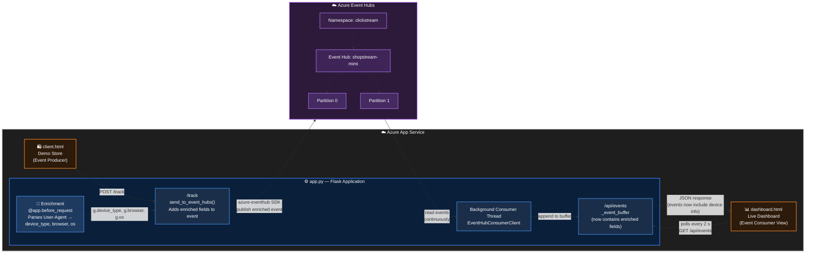

# CST8916 - Assignment 2: Event Hubs Real-Time User-Agent Enrichment & Data Analysis with Azure Stream Analytics

- Mireille Dib
- 040829779
- March 28th, 2026
- [🎥 Watch the Demo on Youtube!](https://youtu.be/JTruGHkFjv8)
---

## Gap 1. Where To Add Enrichment? To Answer, Find Where We Currently Enrich In The Flow
To find out my Gap 1., enriching the data, I had to search in our repository for where we currently gather for data to send to the dashboard.
- Client.html to capture from the user browser then sends to app.py payload to send to eventhub!  

In `client.html`:

```html
<script>   
  // ── Core tracking function ─────────────────────────────────────
  // Sends a POST request to /track with the event details.
  // The Flask backend publishes this to Azure Event Hubs.
  function trackEvent(eventType, page, productId) {
    const payload = {
      event_type: eventType,
      page:       page,
      product_id: productId,
      user_id:    USER_ID,
      session_id: SESSION_ID,
    };

    // Send the event to the Flask /track endpoint
    //...
  }
</script>    
```
In `app.py`:

```python
from azure.eventhub import EventHubProducerClient, EventHubConsumerClient, EventData
# ---------------------------------------------------------------------------
# Helper – send a single event dict to Azure Event Hubs
# ---------------------------------------------------------------------------
def send_to_event_hubs(event_dict: dict):
    """Serialize event_dict to JSON and publish it to Event Hubs."""
    # Gracefully skip if the connection string is not configured yet
    # ...
    
    # EventHubProducerClient is created fresh per request here for simplicity.
    # In a high-throughput production app you would keep a shared client instance.
    producer = EventHubProducerClient.from_connection_string(
        conn_str=CONNECTION_STR,
        eventhub_name=EVENT_HUB_NAME,
    )
    with producer:
        # create_batch() lets the SDK manage event size limits automatically
        event_batch = producer.create_batch()
        event_batch.add(EventData(json.dumps(event_dict)))
        producer.send_batch(event_batch)

@app.route("/track", methods=["POST"])
def track():
    """
    Receive a click event from the browser and publish it to Event Hubs.
    Expected JSON body:
    {
        "event_type": "page_view" | "product_click" | "add_to_cart" | "purchase",
        "page":       "/products/shoes",
        "product_id": "p_shoe_42",       (optional)
        "user_id":    "u_1234"
    }
    """
    # if the incoming request doesnt contain JSON return 400
    # ...

    # Enrich the event with a server-side timestamp
    event = {
        "event_type": request.json.get("event_type", "unknown"),
        "page":       request.json.get("page", "/"),
        "product_id": request.json.get("product_id"),
        "user_id":    request.json.get("user_id", "anonymous"),
        "timestamp":  datetime.now(timezone.utc).isoformat(),
    }

    send_to_event_hubs(event)

    # Also buffer locally so the dashboard works even without a consumer thread
    # ...
    return jsonify({"status": "ok", "event": event}), 201
```

We enrich in `client.html` and send it to `app.py` to send to Azure Event Hubs
dashboard POLLS using GET /api/events to get the data

I gotta add it in client.html, then in app.py to see it in Event Hubs

I found the following user-agent library that can help me retrieve this info using python:
```python
# First, install the necessary libraries:
# pip install pyyaml ua-parser user-agents

from flask import request
from user_agents import parse

@app.route('/details')
def user_agent_details():
    user_agent_string = request.headers.get('User-Agent')
    user_agent = parse(user_agent_string)

    return f"""
    Browser: {user_agent.browser.family} {user_agent.browser.version_string}<br>
    OS: {user_agent.os.family} {user_agent.os.version_string}<br>
    Device: {user_agent.device.family} (Mobile: {user_agent.is_mobile})
    """

```
Then I looked at how I can efficiently add this to a global context so I can call it once before the request for efficiency (rahter than multiple times for each event like a click) and then use that to add on to each event using the global context.  
This is the result of my research:  

> 1. Page Views: Use @app.before_request 
> For page views, a request is already hitting your server. You can use the before_request hook to parse the user-agent once and store it in Flask’s global g object, making it available to your tracking logic without re-parsing it in every route. 

> ```python
> from flask import g, request
> from user_agents import parse # Recommended for better device/OS detection
>
> @app.before_request
> def enrich_event_context():
>    ua_string = request.headers.get('User-Agent')
>    # Parse once per request
>    user_agent = parse(ua_string) 
>    
>    g.event_context = {
>        "device": "mobile" if user_agent.is_mobile else "tablet" if user_agent.is_tablet else "pc",
>        "browser": user_agent.browser.family,
>        "os": user_agent.os.family
>    }
>
>@app.route('/product/<id>')
>def product_page(id):
>    # Log the page view with enriched data from 'g'
>    log_event("page_view", product_id=id, context=g.event_context)
>    return render_template('product.html')
>```
>2. Clicks & Actions: Use an API Pattern
>Actions like "Add to Cart" or "Product Clicks" are usually sent via AJAX/Fetch from the browser. In these cases, your server-side before_request hook will still run for that specific API call. 
>
>The Optimal Way: Create a single /track-event endpoint. When a user clicks a button, the front-end sends the event type (e."add_to_cart") to this endpoint. The endpoint then uses the same g.event_context (populated by before_request) to enrich the data before saving it to your database. 
>
>When to avoid before_request
>Static Files: If you are serving images or CSS through Flask, before_request runs for those too. You may want to skip tracking if request.endpoint is for static files.
>Performance: Parsing a user-agent string is relatively fast, but if your site has massive traffic, doing it on every single request might add overhead. In that case, consider parsing it only on the first request and storing it in a session. 
>Summary Recommendation
>Centralize the parsing in @app.before_request.
>Store the results in g for use during that request.
>Use a library like user-agents for more reliable OS and device detection than Flask's basic built-in parser

Since we are not using static files this solution is sufficient. I plan to look into Sessions as a stretch goal of this assignment if time allows. I will leave my research/thoughts below.

## Stretch Goal: Sessions
then I explored sessions using Flask, to see if I can save it in a session easily
https://testdriven.io/courses/learn-flask/sessions/
session data would be stored in-memory of the app service (using RAM) and be terminated once the app goes down whicih is fine 
It uses a `session` object to store the data in cookies that are cryptographically-signed (not encrypted so no sensitive info) 
we don't need to store in a db we just need to send to Event Hub so this could be a stretch goal. 


## My approach

### 1. Install user-agent parsing library 
User-agents library wraps `ua-parser` and enriches the info for a `ua` for `is_mobile` `is_tablet`, `browser.family`, `os.family`, etc.
```bash
pip install user-agents
```
Then I added this library to `requirements.txt`: `user-agents==2.2.0`

### 2. Add a `before_request` hook
ina `app.py` I define a function that runs before every request which will parse the `User-Agent` header and store the enriched context data we want in Flask's `g` object for later reference. 

```python
from flask import g, request
from user_agents import parse

@app.before_request
def enrich_event_context():
    ua_string = request.headers.get('User_Agent')
    if ua_string:
        user_agent = parse(ua_string)
        g.device_type = (
            "mobile" if user_agent.is_mobile else
            "tablet" if user_agent.is_tablet else
            "pc"
        )
        g.browser = user_agent.browser.family
        g.os = user_agent.os.family
    else:
        # fallback for requests without UA (e.g., some API clients)
        g.device_type = "unknown"
        g.browser = "unknown"
        g.os = "unknown"
```
This `before_request` hook runs before each request made to our application, including
- Initial GET `/` and `/track` (as well as even `/dashbaord` since its a part of this `app.py` routes although we don't care for it)
- The AJAX POST request to `/track`

### 3. Enrich Event for Event Hubs Payload (Within `/track` Route)

Inside our existing `/track` route, lets add this user agent's enriched data we saved to Flask's `g` object and send it to Event Hubs to see in the Azure Portal.  

```python
@app.route("/track", methods=["POST"])
def track():
    if not request.json:
        abort(400)

    event = {
        "event_type": request.json.get("event_type", "unknown"),
        "page":       request.json.get("page", "/"),
        "product_id": request.json.get("product_id"),
        "user_id":    request.json.get("user_id", "anonymous"),
        "session_id": request.json.get("session_id", ""),  # already sent from JS
        "timestamp":  datetime.now(timezone.utc).isoformat(),
        # Our new user-agent context
        "device_type": g.get("device_type", "unknown"),
        "browser": g.get("browser", "unknown"),
        "os": g.get("os", "unknown"),
    }

    send_to_event_hubs(event)

    # Also buffer event locally
    # ...
     
    return jsonify({"status": "ok", "event": event}), 201
```

### 4. See our User-Agent Enrichment Data in dashboard.html
We need to modify the dashboard to render the new fields. 
As long as our user-agent data is stored in `_event_buffer`- which it is, our API `/api/events` returns them, but right now our dashboard is ignoring these fields. 

To change this, the JS function `renderFeed(events)` currently builds a row using only `ts`, `type`, `page` and `user_id` so we will modify it to refer to our new fields `device_type`, `browser`, and `os`.

Shop after gap 1. solution implemented:  
["Gap 1 Implementation: Shop "](gap1-shop.png)

Dashboard after gap 1. solution implemented:  
["Gap 1 Implementation: Dashboard "](gap1-dashboard.png)

## Gap 1 Progress: Implementation Architecture Diagram
Current Project State as of this point: 


---
## Gap 2. Stream Analytics Query + Dashboard Integration

**My Tasks:**

1. Create an **Azure Stream Analytics job** that reads from your Event Hubs instance.

2. **Write the SAQL queries** that answer both business questions. Choose the windowing strategy, aggregation logic, and output columns. All queries must use `TIMESTAMP BY`.
   - **Q1:** *"Which device types are most active?"* — Continuous breakdown of traffic by device type to prioritise mobile vs. desktop campaigns.
   - **Q2:** *"Are there traffic spikes?"* — Detect bursts of activity in the event stream to correlate with promotions or incidents.

3. **Display the results on your dashboard.** Update `dashboard.html` to show both insights — device type breakdown and spike detection — updated as new windows complete.

### 1. Create Azure Stream Analytics Job

- In the Azure portal, went to Event Hubs → `shopstream-mimi` Namespace → Event Hubs: `clickstream` → Process Data → *Enable real time insights from events* → `Start`.
- Created a storage account `cst8916week10storageacc` with the most basic configuration (LRS).
- Created a blob containers `bloboutputq1` & `bloboutputq2`.
- Created Stream Analytics job `cst8916week10saj1`.
  - Set input: Event Hub `clickstream` with default auto‑fill configurations.
  - Set output: `bloboutputq1` & `bloboutputq2` with default auto‑fill configurations.

### 2. Write SAQL Queries

**Q1:** *"Which device types are most active?"* — They want a continuous breakdown of traffic by device type so they can prioritise mobile vs. desktop campaigns.

**Q2:** *"Are there traffic spikes?"* — They want to detect bursts of activity in the event stream so they can correlate them with promotions or incidents.

To accomplish these, I did some research on the following:

- [Analytic functions – Azure Stream Analytics](https://learn.microsoft.com/en-us/stream-analytics-query/analytic-functions-azure-stream-analytics)
- To learn SAQL, I reviewed the rules and documentation for [aggregation functions](https://learn.microsoft.com/en-us/stream-analytics-query/aggregate-functions-azure-stream-analytics) and [query language elements](https://learn.microsoft.com/en-us/stream-analytics-query/query-language-elements-azure-stream-analytics). I already have some knowledge of SQL, so it was mostly a matter of remembering aggregations, learning the rules for SAQL aggregation functions, and understanding how to use windows.

`TIMESTAMP BY` is used to choose the specific data field for event time windowing, especially in situations like ours where we have multiple time fields. I used `TIMESTAMP BY timestamp` to use the `timestamp` field as it is in UTC. I also discovered that the `timestamp` field is a string (JSON property), and Azure Stream Analytics (ASA) automatically parses strings like this into a `datetime` type, which is really helpful.

**Decisions I made for Q1 – "Which device types are most active?"**

- **Windows**
  - `TumblingWindow` allows me to have a simple count of events by device_type over a fixed interval. I chose a 10‑second window for this assignment because the dashboard polls every 2 seconds, so 10 seconds gives a clean snapshot without overwhelming the UI. In a real deployment, I might use a longer window (e.g., 1 minute or 1 hour) depending on how often the report is consumed.
  - `HoppingWindow` would be good for seeing a moving average / trend over overlapping periods (e.g., average page views over the last minute, updated every 10 seconds).
  - `SlidingWindow` is an event‑driven overlapping window: each new event includes all events that happened within the previous specified interval (e.g., total clicks in the last 10 seconds, refreshing with each new click). This is what I used for API throughput metrics at my last job. For seeing trends, it wouldn’t be as helpful because it would be too volatile.

**Decisions I made for Q2 – "Are there traffic spikes?"**

- **Window choice – TumblingWindow(second, 10)**  
  I kept the same tumbling window size (10 seconds) as in Q1 so that both outputs are aligned on the same time boundaries. This makes it easy to correlate a spike with the device breakdown that happened in the same window.

- **Spike detection method – fixed threshold with HAVING**  
  Instead of using complex rolling averages, I used a simple **fixed threshold** with the `HAVING` clause. I set the threshold to `10` for this assignment to demonstrate spikes clearly (any 10‑second window with more than 10 events triggers an alert). In a production scenario, the threshold would be determined by historical traffic patterns (e.g., 3× the average).  
  - The `HAVING` clause filters the output to include only those windows where the condition is met. This means the output blob will only contain rows for spike windows, making it easy to detect bursts.

- **Why not a rolling average?**  
  A rolling average would adapt to changing traffic, but it requires more complex query logic (e.g., `LAG` or user‑defined functions). For this assignment, a fixed threshold is simpler to implement and still clearly shows the concept of spike detection.

**Overall job architecture – one ASA job with two outputs**  
I decided to use a **single ASA job** containing both queries, each writing to its own blob output (`bloboutputq1` for device breakdown, `bloboutputq2` for spike alerts). This approach is simpler than running two separate jobs because:  
- It reduces resource usage (only one job to start/stop and monitor).  
- Both queries share the same input configuration, which avoids duplication.  
- The outputs are automatically separated into different blobs (`bloboutputq1`, `bloboutputq2`), which makes it easier for the Flask dashboard to fetch each data set independently without having to filter mixed records.

The queries themselves are shown below:

```SQL
-- ------------------------------------------------------------
-- Q1: Device breakdown – count events per device type every 10 seconds
-- ------------------------------------------------------------
SELECT
    device_type,
    COUNT(*) AS event_count,
    System.Timestamp AS window_end
INTO
    [bloboutputq1]
FROM
    [clickstream]
TIMESTAMP BY timestamp
GROUP BY
    device_type,
    TumblingWindow(second, 10)

-- ------------------------------------------------------------
-- Q2: Spike detection – count total events per 10‑second window and alert if above threshold
-- ------------------------------------------------------------
SELECT
    System.Timestamp AS window_end,
    COUNT(*) AS event_count
INTO
    [bloboutputq2]
FROM
    [clickstream]
TIMESTAMP BY timestamp
GROUP BY
    TumblingWindow(second, 10)
HAVING COUNT(*) > 10          -- set spike alert to 10 for demonstrating spikes for assignment
```
This structure answers both business questions efficiently and provides clean, separated outputs for the dashboard.

### 3. Display on Dashboard

With the ASA job running producing JSON data in the 2 blobs, now let's adjust our Flask App to retrieve this information from our blobs, and then adjust our dashboard to display this new analysed data.

**1. Install Azure SDK for blob access & add to requirements.txt**

```bash
pip install azure-storage-blob
```

**2. Add Storage Connection String as Env Var**

In local environment & Azure App Service Settings we need to set: 
```bash
AZURE_STORAGE_CONNECTION_STRING = "DefaultEndpointsProtocol=https;AccountName=...;AccountKey=...;EndpointSuffix=core.windows.net"
```
This is the connection nstring for the sotrage account `cst8916week10storageacc` that hosts our blob containers `bloboutputq1` and `bloboutputq2`.
Get this from going to the Storage Account -> Security + Networking -> Access Keys under Connection String.

**3. Add Help Function and Endpoints in `app.py`**

```python
# ---------------------------------------------------------------------------
# Azure Blob Storage – read latest ASA output from separate containers
# ---------------------------------------------------------------------------
from azure.storage.blob import ContainerClient, BlobServiceClient
import json

STORAGE_CONN_STR   = os.environ.get("AZURE_STORAGE_CONNECTION_STRING", "")
STORAGE_ACCOUNT    = "cst8916week10storageacc"

# Container names match the ASA output aliases exactly
CONTAINER_Q1 = "bloboutputq1"   # device breakdown output
CONTAINER_Q2 = "bloboutputq2"   # spike alerts output


def get_latest_blob_from_container(container_name: str) -> list:
    """
    Return the parsed JSON records from the most recently modified blob
    inside the given container.

    Works with both:
      - connection string auth  (AZURE_STORAGE_CONNECTION_STRING is set)
      - anonymous / public access (connection string is empty)

    ASA writes one JSON record per line (JSONL format), so we split on
    newlines and parse each line individually.
    """
    try:
        if STORAGE_CONN_STR:
            # Authenticated access via connection string
            container_client = ContainerClient.from_connection_string(
                conn_str=STORAGE_CONN_STR,
                container_name=container_name,
            )
        else:
            # Anonymous / public access – build the URL from the account name
            account_url = f"https://{STORAGE_ACCOUNT}.blob.core.windows.net"
            container_client = ContainerClient(
                account_url=account_url,
                container_name=container_name,
                credential=None,          # no credentials = anonymous
            )

        blobs = list(container_client.list_blobs())
        if not blobs:
            return []

        # Pick the most recently modified blob (latest ASA window output)
        blobs.sort(key=lambda b: b.last_modified, reverse=True) # order from most recent changed to oldest - b (a blob in the list)
            # last_modified is a timestamp that tracks when a blob was last changed 
        latest_blob = blobs[0]

        blob_client = container_client.get_blob_client(latest_blob.name)
        raw = blob_client.download_blob().readall().decode("utf-8").strip()

        if not raw:
            return []

        # ASA writes JSONL – one JSON object per line
        records = []
        for line in raw.split("\n"):
            line = line.strip()
            if line:
                try:
                    records.append(json.loads(line))
                except json.JSONDecodeError:
                    pass   # skip malformed lines

        return records

    except Exception as exc:
        app.logger.error(f"Blob read error ({container_name}): {exc}")
        return []


@app.route("/api/device-breakdown", methods=["GET"])
def device_breakdown():
    """
    Return the latest device-breakdown records from bloboutputq1.

    Each record has the shape:
        { "device_type": "pc", "event_count": 5, "window_end": "2026-03-29T..." }
    """
    data = get_latest_blob_from_container(CONTAINER_Q1)
    return jsonify(data), 200


@app.route("/api/spike-alerts", methods=["GET"])
def spike_alerts():
    """
    Return the latest spike-alert records from bloboutputq2.

    Each record has the shape:
        { "window_end": "2026-03-29T...", "event_count": 7 }

    Only windows where event_count > 10 are written here (enforced by HAVING element in ASA query).
    """
    data = get_latest_blob_from_container(CONTAINER_Q2)
    return jsonify(data), 200

```
Once added, I ran locally and logged the events to test this section worked before moving on to the next step.

**4. Update `dashboard.html`**

These were the changes made:
- Adding two new panels inside `.panels`
- Added `fetchDeviceBreakdown()` to read from `/api/device-breakdown` endpoint and render a bar chart. We set the bar width scale relate to the actual max of the data rather than hardcoding to 100 so small counts still look meaningful. 
- Added `fetchSpikealerts()` to read from `/api/spike-alerts` endpoint 
- Added `fetchAndRender()` to call both new functions on every 2-second poll for fast updates.

## Architecture Diagram - Gap 1. and Gap 2. Completed

```mermaid
flowchart LR
    subgraph AAS["☁️ Azure App Service"]
        direction TB
        Store["🛍️ client.html<br/>Demo Store<br/>(Event Producer)"]
        Dashboard["📊 dashboard.html<br/>Live Analytics Dashboard"]

        subgraph Flask["⚙️ app.py — Flask Application"]
            direction TB
            Enrich["📝 User-Agent Enrichment<br/>@app.before_request<br/>Parses User-Agent →<br/>device_type, browser, os"]
            Track["/track<br/>Enriched Event Publisher"]
            LiveAPI["/api/events<br/>Live Event Buffer<br/>(Real-time feed)"]
            DeviceAPI["/api/device-breakdown<br/>Reads from bloboutputq1"]
            SpikeAPI["/api/spike-alerts<br/>Reads from bloboutputq2"]
            Consumer["Background Consumer Thread<br/>EventHubConsumerClient"]
            BlobReader["get_latest_blob_from_container()<br/>Azure Blob SDK"]
        end

        Store -->|"POST /track<br/>user events"| Track
        Dashboard -->|"polls every 2s<br/>GET /api/events"| LiveAPI
        Dashboard -->|"polls every 2s<br/>GET /api/device-breakdown"| DeviceAPI
        Dashboard -->|"polls every 2s<br/>GET /api/spike-alerts"| SpikeAPI
    end

    subgraph EH["☁️ Azure Event Hubs"]
        direction TB
        NS["Namespace: clickstream"]
        Hub["Event Hub: shopstream-mimi"]
        P0["Partition 0"]
        P1["Partition 1"]
        NS --> Hub
        Hub --> P0
        Hub --> P1
    end

    subgraph ASA["☁️ Azure Stream Analytics"]
        direction TB
        Job["Stream Analytics Job<br/>cst8916week10saj1"]
        Q1["Q1: Device Breakdown<br/>GROUP BY device_type<br/>TumblingWindow(second, 10)"]
        Q2["Q2: Spike Detection<br/>COUNT(*)10<br/>TumblingWindow(second, 10)"]
        Job --> Q1
        Job --> Q2
    end

    subgraph Storage["☁️ Azure Blob Storage<br/>cst8916week10storageacc"]
        direction TB
        Container1["📦 bloboutputq1<br/>(Device breakdown results)"]
        Container2["📦 bloboutputq2<br/>(Spike alert results)"]
    end

    %% Data Flow
    Enrich -->|"g.device_type, g.browser, g.os"| Track
    Track -->|"azure-eventhub SDK<br/>enriched events"| EH
    EH -->|"continuous read"| Consumer
    Consumer -->|"append to buffer"| LiveAPI

    EH -->|"input stream"| ASA
    Q1 -->|"JSONL output"| Container1
    Q2 -->|"JSONL output"| Container2

    BlobReader -->|"read latest blob"| Container1
    BlobReader -->|"read latest blob"| Container2
    Container1 -->|"device data"| DeviceAPI
    Container2 -->|"spike data"| SpikeAPI

    %% Styling
    style Store     fill:#2c1a0a,stroke:#e67e22,stroke-width:2px,color:#ffffff
    style Dashboard fill:#2c1a0a,stroke:#e67e22,stroke-width:2px,color:#ffffff
    style Flask     fill:#0a1f3a,stroke:#3b82f6,stroke-width:2px,color:#ffffff
    style Enrich    fill:#1e3a5f,stroke:#4b9eff,stroke-width:1.5px,color:#ffffff
    style Track     fill:#1a2e4a,stroke:#4b9eff,stroke-width:1.5px,color:#ffffff
    style LiveAPI   fill:#1a2e4a,stroke:#4b9eff,stroke-width:1.5px,color:#ffffff
    style DeviceAPI fill:#1a2e4a,stroke:#4b9eff,stroke-width:1.5px,color:#ffffff
    style SpikeAPI  fill:#1a2e4a,stroke:#4b9eff,stroke-width:1.5px,color:#ffffff
    style Consumer  fill:#1a2e4a,stroke:#4b9eff,stroke-width:1.5px,color:#ffffff
    style BlobReader fill:#1a2e4a,stroke:#4b9eff,stroke-width:1.5px,color:#ffffff
    style AAS       fill:#1e1e1e,stroke:#8e8e8e,stroke-width:2px,color:#ffffff
    style EH        fill:#2d1a3a,stroke:#b77bff,stroke-width:2px,color:#ffffff
    style NS        fill:#38204a,stroke:#b77bff,stroke-width:1.5px,color:#ffffff
    style Hub       fill:#3f2457,stroke:#b77bff,stroke-width:1.5px,color:#ffffff
    style P0        fill:#442a60,stroke:#b77bff,stroke-width:1.5px,color:#ffffff
    style P1        fill:#442a60,stroke:#b77bff,stroke-width:1.5px,color:#ffffff
    style ASA       fill:#0d2818,stroke:#3fb950,stroke-width:2px,color:#ffffff
    style Job       fill:#1a3a2a,stroke:#3fb950,stroke-width:1.5px,color:#ffffff
    style Q1        fill:#1a3a2a,stroke:#3fb950,stroke-width:1.5px,color:#ffffff
    style Q2        fill:#1a3a2a,stroke:#3fb950,stroke-width:1.5px,color:#ffffff
    style Storage   fill:#3a1a0d,stroke:#f85149,stroke-width:2px,color:#ffffff
    style Container1 fill:#4a2a1a,stroke:#f85149,stroke-width:1.5px,color:#ffffff
    style Container2 fill:#4a2a1a,stroke:#f85149,stroke-width:1.5px,color:#ffffff

```

